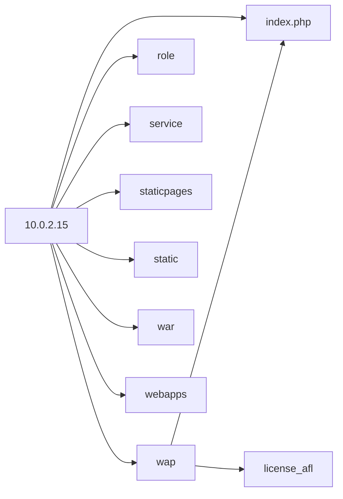
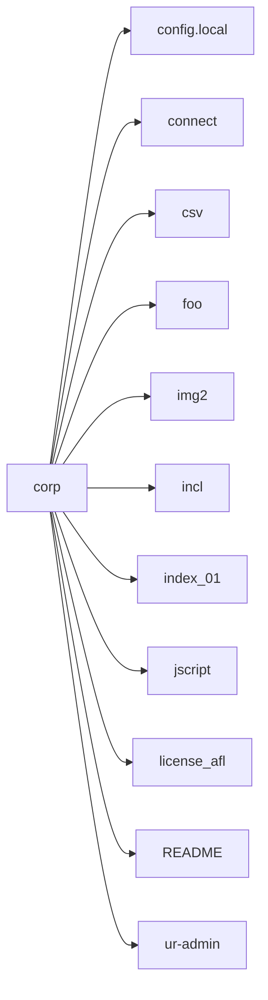

# Diagramas Mermaid

## Subgráfico 1: [`10.0.2.15`](command:_github.copilot.openSymbolFromReferences?%5B%7B%22%24mid%22%3A1%2C%22path%22%3A%22%2Fd%3A%2FCursos%2FREPOSITORIOS%2FCIBERSEGURIDAD_THEBRIDGE%2FGENERAL_TEAM_CHALLENGES%2FRETO_6%2Fmermaid_2_graficos.md%22%2C%22scheme%22%3A%22file%22%7D%2C%7B%22line%22%3A2%2C%22character%22%3A0%7D%5D "mermaid_2_graficos.md") y [`WAP`](command:_github.copilot.openSymbolFromReferences?%5B%7B%22%24mid%22%3A1%2C%22path%22%3A%22%2Fd%3A%2FCursos%2FREPOSITORIOS%2FCIBERSEGURIDAD_THEBRIDGE%2FGENERAL_TEAM_CHALLENGES%2FRETO_6%2Fmermaid_2_graficos.md%22%2C%22scheme%22%3A%22file%22%7D%2C%7B%22line%22%3A2%2C%22character%22%3A0%7D%5D "mermaid_2_graficos.md")

## Subgráfico 2: `corp`

