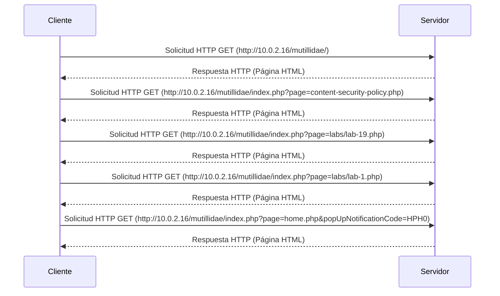

```mermaid
sequenceDiagram
    participant Cliente
    participant Servidor

    Cliente->>Servidor: Solicitud HTTP GET (http://10.0.2.16/mutillidae/)
    Servidor-->>Cliente: Respuesta HTTP (Página HTML)

    Cliente->>Servidor: Solicitud HTTP GET (http://10.0.2.16/mutillidae/index.php?page=content-security-policy.php)
    Servidor-->>Cliente: Respuesta HTTP (Página HTML)

    Cliente->>Servidor: Solicitud HTTP GET (http://10.0.2.16/mutillidae/index.php?page=labs/lab-19.php)
    Servidor-->>Cliente: Respuesta HTTP (Página HTML)

    Cliente->>Servidor: Solicitud HTTP GET (http://10.0.2.16/mutillidae/index.php?page=labs/lab-1.php)
    Servidor-->>Cliente: Respuesta HTTP (Página HTML)

    Cliente->>Servidor: Solicitud HTTP GET (http://10.0.2.16/mutillidae/index.php?page=home.php&popUpNotificationCode=HPH0)
    Servidor-->>Cliente: Respuesta HTTP (Página HTML)
```